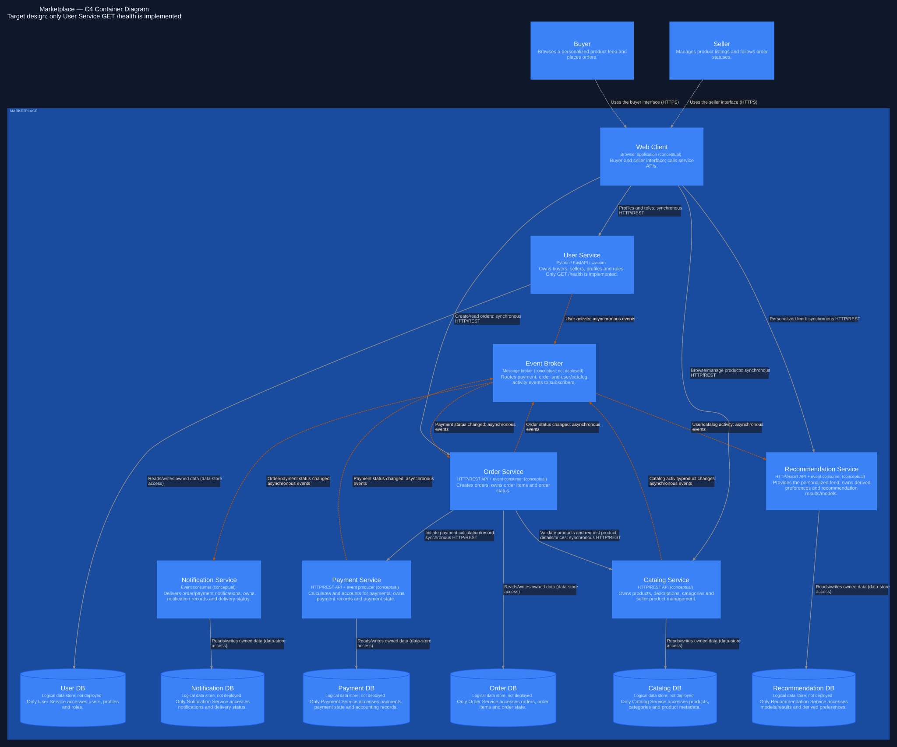

# Marketplace Architecture

## 1. Scope and Requirements

The marketplace is a digital platform where sellers publish products and buyers place orders. The target architecture supports a personalized product feed, seller catalog management, buyer and seller management, order creation, payment calculation and accounting, and notifications about order statuses.

This homework contains **architecture and service initialization only**. No marketplace business logic is implemented. Only User Service is initialized for execution, with `GET /health`. The web client, other services, all databases and the Event Broker are conceptual elements.

## 2. Domains and Responsibilities

| Domain | Service | Responsibility | Owned Data |
| --- | --- | --- | --- |
| Users | User Service | Manage buyers, sellers, profiles and roles | Users, profiles, roles |
| Catalog | Catalog Service | Manage products, descriptions, categories and seller listings | Products, categories, product metadata |
| Recommendations | Recommendation Service | Build a personalized feed from user activity | Recommendation models/results, preferences derived from events |
| Orders | Order Service | Create orders and maintain their status | Orders, order items, order state |
| Payments | Payment Service | Calculate payments, track payment status and keep accounting records | Payments, payment state, accounting-related payment records |
| Notifications | Notification Service | Deliver notifications about orders and payments | Notification records, delivery status |

## 3. Service Decomposition

Each domain maps to one service because it has a distinct responsibility and owns a distinct set of data:

- **User Service:** buyer/seller profiles and roles belong together. Changing a profile should not require changing the catalog or payment records.
- **Catalog Service:** product descriptions and categories change independently from payment processing. Sellers need one place to manage listings.
- **Recommendation Service:** feed generation uses derived data and can tolerate delayed updates. Its computation and scaling needs differ from order processing.
- **Order Service:** order items and order status form one lifecycle. Order state needs reliable updates within its own store, while recommendations can be eventually consistent.
- **Payment Service:** payment state and accounting records have a clear ownership boundary. Product editing must not change historical payment records.
- **Notification Service:** delivery attempts and delivery status are separate from order state. A delivery failure should not undo an order or a recorded payment.

These are logical deployment boundaries in the target architecture. This repository does not implement the interactions or persistence described here.

## 4. C4 Container Architecture

The diagram source is [architecture/marketplace.c4](architecture/marketplace.c4). It describes the **C4 Container level**: applications, services, the broker and data stores inside the Marketplace boundary. It does not show classes, functions or internal components. A C4 container is a running application or data store; it does not necessarily mean a Docker container.

The rendered version is [architecture/marketplace.svg](architecture/marketplace.svg). Open it separately to zoom in on labels.



- **Buyer** browses products and a personalized feed, then places orders.
- **Seller** manages product listings and follows order statuses.
- **Web Client** is the conceptual browser interface for both people. It calls the User, Catalog, Recommendation and Order APIs directly.
- **Six services** separate the domains listed above. Only User Service has source code and a Docker image.
- **Event Broker** routes events between producers and subscribers. No broker product is selected or deployed.
- **Six databases** represent exclusive service ownership. They are logical stores, not deployed databases.

Every service-to-service or client-to-service relationship is labeled `synchronous HTTP/REST` and uses a solid line; broker relationships are labeled `asynchronous events` and use dashed amber lines. Database arrows represent direct access by the owning service only. Person arrows show use of the web interface.

### Viewing and validating the diagram

Open the `.c4` file with the LikeC4 extension for VS Code, or use the optional LikeC4 CLI. Node.js 22.22.3 or newer is required by the pinned CLI version. From the repository root:

```sh
npx --yes likec4@1.59.4 validate architecture
npx --yes likec4@1.59.4 serve architecture
```

Diagram tooling is optional and is not needed to run User Service.

The SVG was generated from the LikeC4 model using Graphviz. To regenerate it, install Graphviz and run:

```sh
npx --yes likec4@1.59.4 codegen dot architecture -o /tmp/marketplace-diagram
dot -Tsvg /tmp/marketplace-diagram/containers.dot -GTBbalance=max \
  -Gbgcolor='#0f172a' -Gfontcolor='#eff6ff' \
  -Glabel='Marketplace — C4 Container Diagram\nTarget design; only User Service GET /health is implemented' \
  -Glabelloc=t -o architecture/marketplace.svg
```

## 5. Data Ownership

**Each service owns its own data. No shared databases are used.** Other services must never directly read or write another service's database. They request information through APIs or consume events.

This makes ownership clear and prevents coupling through shared tables. For example, Order Service requests product information from Catalog Service rather than querying Catalog DB. An order would retain a snapshot of its items and prices, so later catalog edits would not rewrite an existing order. Such persistence is only a design decision here.

| Service | Owned Data Store | Main Data |
| --- | --- | --- |
| User Service | User DB | Users, profiles, roles |
| Catalog Service | Catalog DB | Products, categories, product metadata |
| Recommendation Service | Recommendation DB | Recommendation models/results, derived preferences |
| Order Service | Order DB | Orders, items, order state |
| Payment Service | Payment DB | Payment records, state, accounting records |
| Notification Service | Notification DB | Notification records, delivery status |

Database-per-service describes ownership, not a requirement for six physical database servers. No database engine is selected and no database is deployed in this homework.

## 6. Service Communication

### Synchronous communication

HTTP/REST is used when the caller needs an immediate response:

| Caller | Receiver | Purpose |
| --- | --- | --- |
| Web Client | User Service | Request buyer/seller profile and role information |
| Web Client | Catalog Service | Browse products or manage seller listings |
| Web Client | Recommendation Service | Request the personalized feed |
| Web Client | Order Service | Create an order or request its status |
| Order Service | Catalog Service | Validate products and request current details/prices |
| Order Service | Payment Service | Initiate payment calculation and create a payment record |

A successful payment-initiation response would mean the request was accepted, not necessarily that payment completed. A later payment-status event informs Order Service of the result. HTTP calls can time out or fail, so one service's availability can affect its caller. These are planned interactions; none are implemented.

### Asynchronous communication

Services publish events to the conceptual Event Broker. Subscribers receive them without the producer waiting for subscriber work to finish:

| Producer | Event | Consumer through Event Broker |
| --- | --- | --- |
| Payment Service | Payment status changed | Order Service, Notification Service |
| Order Service | Order status changed | Notification Service |
| User Service | User activity | Recommendation Service |
| Catalog Service | Catalog activity/product changes | Recommendation Service |

In this design, the user/catalog APIs would capture relevant activity, such as preference changes or product views, and publish it. Recommendation Service would maintain its own derived preferences and results rather than read User DB or Catalog DB.

Notifications do not need to delay the order response. Recommendation data can be updated after activity occurs. Events allow these workloads to process independently.

The trade-off is **eventual consistency**: order status, notifications and feed results can lag behind the original change. Debugging is harder because a request and its later effects cross multiple services. A real implementation would need reliable event publication, retries and duplicate handling; those mechanisms are outside this initialization assignment.

## 7. Alternative Architecture 1: Modular Monolith

One backend deployment contains six internal modules: **Users, Catalog, Recommendations, Orders, Payments and Notifications**. The web client talks to this single backend. Modules call each other in process instead of through service-to-service HTTP. A single database can use module-owned tables or schemas, accessed through module interfaces.

**Advantages:**

- One backend is simpler to deploy and run locally.
- In-process calls avoid service-to-service network failures.
- Transactions across order and payment tables are easier within one database.
- Debugging a request usually involves one process.

**Disadvantages:**

- The entire backend is deployed together, even for a small catalog change.
- Scaling only recommendations or catalog traffic is harder.
- Modules can become coupled if developers bypass their interfaces.
- Independent team ownership becomes harder as the codebase grows.

**Trade-off:** lower operational cost and easier transactions, in exchange for coarser deployment and scaling. Module boundaries still need discipline; a monolith does not have to be unstructured.

## 8. Alternative Architecture 2: Domain-Oriented Services

The selected architecture uses six separate services, each with its own logical database. The web client calls service APIs. Services use HTTP/REST for immediate responses and the Event Broker for asynchronous integration.

**Advantages:**

- Domain boundaries and data ownership are explicit.
- Services can be deployed and evolved independently when their contracts remain compatible.
- Each domain can scale separately; recommendation work need not scale with payments.
- Events allow notifications and feed updates to run independently of transaction requests.

**Disadvantages:**

- Network calls can fail or time out.
- Multiple deployments and a broker add operational complexity.
- Events introduce eventual consistency.
- Debugging and observability must connect work across services.
- Cross-service transactions cannot rely on a single local database transaction.

**Trade-off:** independent deployment, ownership and scaling require more coordination and failure handling. For example, an order and a payment can be temporarily out of sync; their workflow would need explicit recovery rules in a real implementation.

## 9. Trade-offs

| Aspect | Modular Monolith | Domain-Oriented Services |
| --- | --- | --- |
| Deployment | One backend release | Separate service releases; compatible API/event contracts needed |
| Complexity | Fewer moving parts | Network calls, event delivery and multiple runtimes |
| Scaling | Scale the whole backend | Scale each domain separately |
| Transactions | Local transactions can span module tables | Local transactions per service; cross-service coordination is harder |
| Data ownership | Module-owned tables/schemas; boundaries enforced in code | Separate stores; ownership enforced through APIs/events |
| Failure modes | Process failure can affect all modules; fewer network failure points | Individual services can fail; dependent HTTP calls and event delivery can fail too |
| Development/operations | Easier local setup and tracing | More deployments and harder tracing; teams can work independently |

Neither architecture is universally better. The choice depends on scale, team structure and the cost of operating separate services.

## 10. Final Architecture Decision

**Selected option: Domain-Oriented Services.**

This assignment explicitly evaluates domain boundaries, mapping domains to services, service data ownership, synchronous interactions and asynchronous interactions. Separate services and owned stores make these concepts visible in the diagram and documentation.

For a small real-world MVP, a modular monolith could be a simpler initial choice because it has less operational complexity. The selection here follows the learning goals and the requested domain decomposition, not a claim that every marketplace needs microservices.

## 11. Implemented Service

Only **User Service** is physically initialized, using Python 3.12, FastAPI and Uvicorn. It exposes exactly one route: `GET /health`. FastAPI's automatic documentation and OpenAPI routes are disabled to keep the HTTP surface limited to that endpoint.

There is no user CRUD, authentication, authorization, JWT, ORM, database connection or marketplace business logic. The other services, databases, Web Client and Event Broker are architectural elements only. They are intentionally not implemented because the assignment prohibits implementing business functionality.

Docker Compose runs only `user-service`. The Docker healthcheck uses Python's standard library, so it does not require installing curl inside the image.

## 12. Running the Project

Prerequisites: Docker Engine or Docker Desktop with Docker Compose v2, plus curl for the manual request. Port 8000 must be free. Run all commands from the repository root:

```sh
docker compose up --build
```

In another terminal:

```sh
curl -i http://localhost:8000/health
```

For the body only:

```sh
curl http://localhost:8000/health
```

To stop, press `Ctrl+C` in the Compose terminal, then remove the stopped container and network:

```sh
docker compose down
```

For a background run with a readiness check:

```sh
docker compose up --build -d --wait
docker compose ps
curl -i http://localhost:8000/health
docker compose down
```

No environment variables, credentials or external services are required at runtime. The first build needs access to the Python base image registry and the Python package index.

## 13. Health Check

Request: `GET http://localhost:8000/health`

Expected status: **HTTP 200 OK**

Expected JSON:

```json
{
  "status": "ok"
}
```

The wire response is `{"status":"ok"}`. This is a process health check: it proves the initialized API responds, not that users, payments or any other marketplace feature works.

The image healthcheck verifies both HTTP 200 and the JSON body. To inspect its status after starting Compose:

```sh
docker compose ps
```

### Verification performed in the cloud environment

| Check | Result |
| --- | --- |
| Python syntax, FastAPI imports and dependency compatibility | Passed |
| Live Uvicorn `GET /health` | HTTP 200 with exactly `{"status":"ok"}` |
| Route scope | Only `GET /health` is registered; docs, OpenAPI and user routes are absent |
| LikeC4 syntax and semantics | Passed with LikeC4 1.59.4 |
| Static diagram | SVG rendered from the LikeC4 model with Graphviz |
| Docker Compose configuration | Passed `docker compose config --quiet` |
| Docker build and container startup | **Not verified:** build attempted, but the cloud proxy denied Docker Hub with HTTP 403 before the base image could be downloaded |

The endpoint and healthcheck expression were tested in a Python process, **not inside Docker**. Docker container startup and image health status still need a local test using the commands in section 12. The network restriction is an environment limitation, not evidence of a successful or broken image build.

## 14. Repository Structure

```text
.
├── .gitignore
├── README.md
├── architecture/
│   ├── marketplace.c4
│   └── marketplace.svg
├── docker-compose.yml
└── services/
    └── user-service/
        ├── .dockerignore
        ├── Dockerfile
        ├── requirements.txt
        └── app/
            └── main.py
```

## 15. Architecture Decision Summary

- **Service boundaries:** Users, Catalog, Recommendations, Orders, Payments and Notifications each map to one service.
- **Data ownership:** each service exclusively accesses its own logical database; other services use APIs or events.
- **Communication:** HTTP/REST for immediate requests, broker events for payment/order changes and recommendation activity.
- **Selected architecture:** Domain-Oriented Services, compared with a Modular Monolith, to make the assignment's boundaries and interactions explicit.
- **Implementation scope:** only User Service's health endpoint is packaged for Docker. Business features and the remaining architecture are intentionally conceptual.
